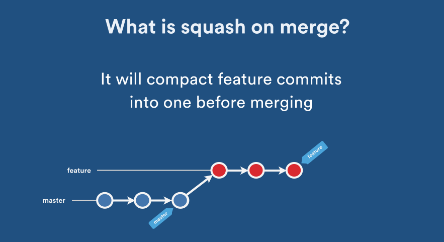

# Git

## Branching strategy

### Git Merge
Git merge is used to integrate changes from one branch into another branch

Git merge, creates a **merge commit**. This commit will point to the merged commits. It will make the **non linear commit history**.

One possible way to create a **linear commit history** is to **squash** the commits. On merge, it will create just a one big commit.

The problem with squash merging, is that you will lost the commit history from the merged branch.

Other possible solution is **Fast Forward**.

Note, you can only use fast forward if the branches haven't diverged. Fast Forward only moves the head.

#### 

### Github Flow
- **master**: Is the main branch that gets deployed. 
- **fetures-branch**: These branchs get checkout from the **master** branch, get features changes, and then get merged back in the **master**.

Good: fast deliveries, easy to debug, good for CI/CD.
Bad: suited for small teams, easier to push bugs to production.

### GitFlow
This branching strategy consists of the following branches:

- **master**: Is the main branch that gets deployed. When new changes are merged, a new tag/release is added.
- **release**: Help prepare a new production release. Usually branched from the develop branch and must be merged back to both **develop** and **master**
- **develop**: Branch to merge new features. It gets checkout from the **release** branch.
- **fetures-branch**: These branchs get checkout from the **develop** branch, get features changes, and then get merged back in the **develop**.
- **hotfix**: Get checkout from **master**, get a hotfix change, and get merged back to **master**

Good: allow work in parallel
Bad: complex and slow, deploy too many changes at the same time(difficult to debug), difficult with CI/CD

### GitLab Flow
[GitLab Flow] (https://docs.gitlab.com/ee/topics/gitlab_flow.html#production-branch-with-gitlab-flow)

In Github Flow, if CD is not available, users won't know what is in production (difficult to know if the changes has been deployed yet).
GitLab Flow will have an extra branch **production**, which will only have the deployed changes.
As well, there can be other branches that show the state of other environments.

Is good when there can't be CD, and there is no control the time of the release.

### Trunk based development

Trunk bases development doesn't use branches (or very short lived ones). Developers just commit to the **trunk** branch and deploy with CD.

The idea is to deliver fast, so most of the time you will need feature flags (to disable half baked feautures).
